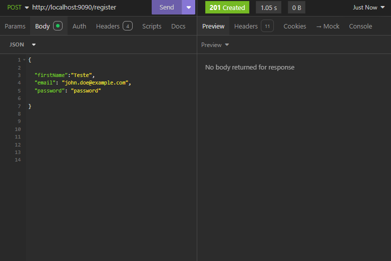

# Sistema de Avaliação de Produtos

Este projeto é um sistema de avaliação de produtos que permite aos usuários avaliar produtos e deixar comentários. O sistema é construído com Spring Boot e inclui integração com PostgreSQL e RabbitMQ. O projeto também inclui uma configuração básica de Docker e um versionamento com git e github.

## Tecnologias Utilizadas

- Backend: Spring Boot

- Banco de Dados: PostgreSQL

- Mensageria: RabbitMQ

- Containerização: Docker

- Versionamento : GitHub e Git

## Funcionalidades

Backend

Modelos e DTOs:

- User - Representa um usuario com id, name, email e senha.

- Product - Representa um produto com id, name, e description.

- Review - Representa uma avaliação com id, productId, userId, rating, e comment.

Endpoints REST:

POST /register - Criar um novo usuario.

POST /login - Fazer o Login.

POST /products - Criar um novo produto.

POST /reviews - Adicionar uma avaliação a um produto.

GET /reviews/{productId} - Listar todas as avaliações de um produto específico.

## Segurança:

Autenticação JWT para proteger os endpoints de criação e consulta de avaliações.

- Validação:

Validação de entradas e autenticação para adicionar avaliações.
Banco de Dados

Armazenamento de informações de produtos e avaliações usando PostgreSQL.

- Mensageria

Interface para adicionar produtos, avaliar produtos, e visualizar avaliações. (Se implementado, a interface pode ser construída com React ou outra biblioteca/framework).

- Docker

Containerização da aplicação e do banco de dados PostgreSQL.

- Versionamento

Pipeline básico para automação de build e deploy.

# IMPORTANTE 

Para facilitar testes manuais de terceiros os endpoints estão todos liberados pelo spring security.

## Contribuições

Contribuições são bem-vindas! Por favor, envie um pull request ou abra uma issue para sugerir melhorias.

## Licença

Este projeto é licenciado sob a Licença MIT